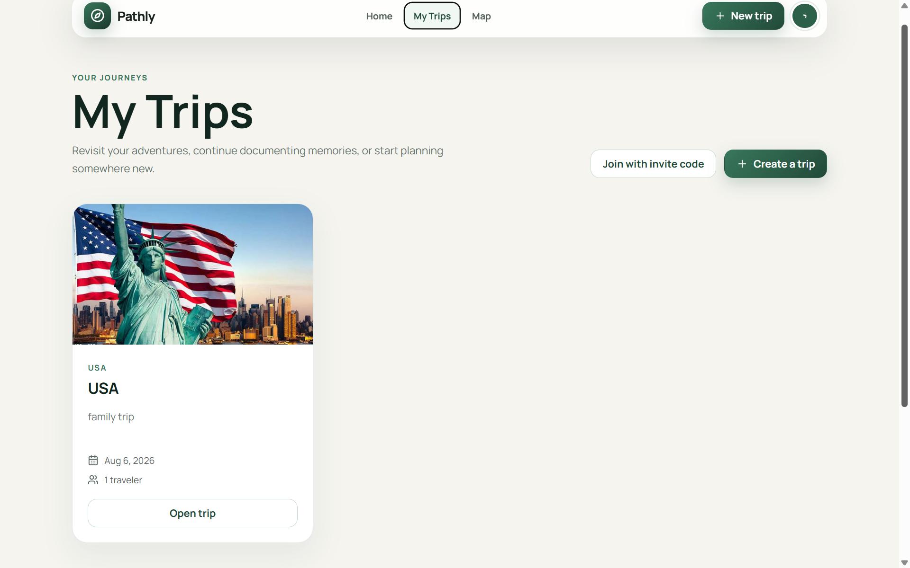
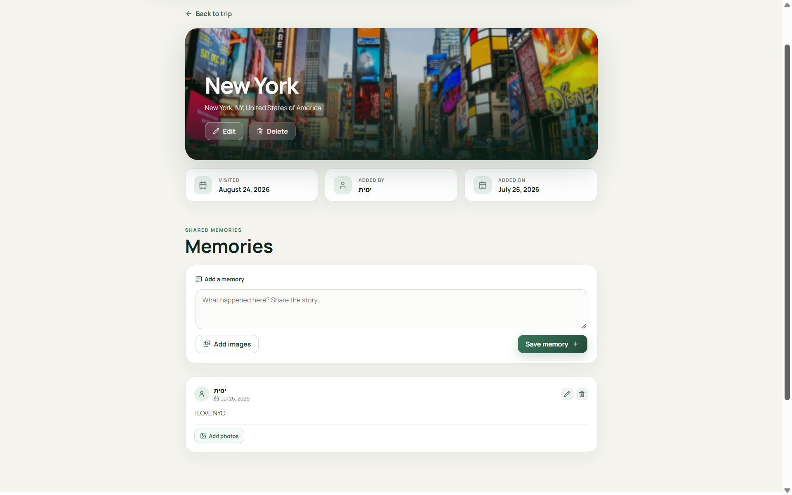
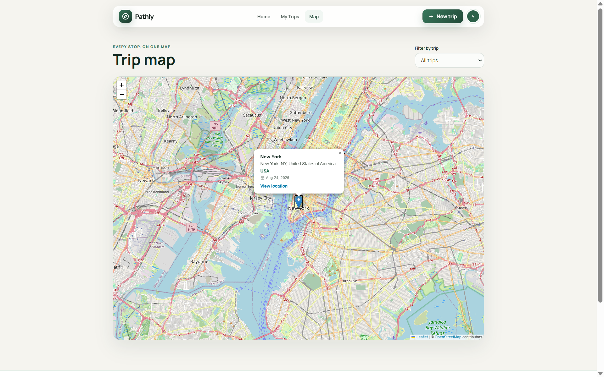

# Pathly

Pathly is a collaborative travel-memory journal. Users create **trips**, add the **locations** they visited during each one, and attach **memories** (text and photos) to each location. Trips can be shared with other travelers through an invite code, so a whole group can build the same travel journal together.

The problem it solves: information, photos, and memories from a shared trip usually end up scattered across different people's phones and different apps. Pathly centralizes all of it in one place, following a clear hierarchy: `User → Trip → Location → Memory`.

Built as a university full-stack final project on the MERN stack (MongoDB, Express, React, Node.js) — **live in production.**

## Live Demo

| | |
| --- | --- |
| **Live Application (Frontend)** | https://adv-full-stack-five.vercel.app |
| **Backend API** | https://pathly-api-8do5.onrender.com |
| **GitHub Repository** | https://github.com/yamitbar/Adv.FullStack |

The frontend is deployed on **Vercel**, the backend API on **Render**, the database on **MongoDB Atlas**, and all media (trip/location cover images, memory photos) on **Cloudinary**.

## Features

- Register and log in with email/password
- JWT authentication
- Protected routes (backend middleware and frontend route guards)
- Trip CRUD (create, view, edit, delete)
- Join a trip by invite code
- Participant authorization (creator vs. participant permissions on every trip/location/memory)
- Location CRUD within a trip
- Geoapify Address Autocomplete on Add/Edit Location
- Interactive map with Leaflet and OpenStreetMap tiles
- Map markers for every location with saved coordinates
- Memory CRUD (text memories attached to a location)
- Trip cover image upload
- Location cover image upload
- Multiple memory image uploads (up to 5 per request)
- Image replacement and deletion
- Cloudinary media storage for all uploaded images
- Joi validation on every request body
- Multer for multipart/form-data handling
- Helmet security headers
- Rate limiting (general + a stricter limiter on login/register)
- Global error handler
- Context API (authentication state)
- Redux Toolkit (trips and memories domain state)
- React.lazy and Suspense (route-level code splitting)
- React.memo (list item components)
- Error Boundary
- Custom Hook (`useBodyScrollLock`)
- Responsive interface across desktop and mobile viewports

## Architecture

Pathly is a **monorepo**:

```
Adv.FullStack/
├── client/                        React Frontend
├── server/                        Node.js / Express Backend
├── docs/                          Project documentation, screenshots
├── README.md
├── render.yaml                    Render deployment blueprint
└── Pathly.postman_collection.json
```

**Request flow:**

```
React / Vercel
      ↓
Axios + JWT
      ↓
Express API / Render
      ↓
MongoDB Atlas
```

The frontend never talks to MongoDB directly — every read/write goes through the Express REST API, which owns all validation and authorization.

**Media upload flow:**

```
React FormData
      ↓
Multer memoryStorage
      ↓
Cloudinary
      ↓
URL + public_id stored in MongoDB
```

Multer still handles incoming `multipart/form-data`, checks the file type, and enforces the size/count limits — but it only ever holds each file in memory long enough to stream it to Cloudinary. Nothing is written to local disk. Cloudinary is responsible for permanent storage; MongoDB stores only the resulting `secure_url` and `public_id` for each image.

### Detailed folder structure

```
Adv.FullStack/
├── client/                  React app (Vite)
│   ├── public/               Static assets
│   ├── src/
│   │   ├── components/       Reusable UI (layout, trips, memories, common)
│   │   ├── context/          AuthContext (Context API)
│   │   ├── pages/             Route-level pages
│   │   ├── services/          Axios instance + media URL helper
│   │   └── store/             Redux Toolkit store + slices
│   ├── .env.example
│   └── vercel.json           Vercel SPA rewrite config
├── server/                  Express API
│   ├── config/                db.js (Mongoose connection), cloudinary.js (Cloudinary SDK config)
│   ├── controllers/           Route handlers, one file per resource
│   ├── middleware/            auth, validation, upload, error handler, rate limiting
│   ├── models/                Mongoose schemas (User, Trip, Location, Memory)
│   ├── routes/                Express routers, one file per resource
│   ├── tests/                 Automated backend smoke tests (Node's built-in test runner)
│   ├── utils/                 Shared helpers (cascade delete, Cloudinary upload/delete, trip membership, tokens)
│   ├── validation/            Joi schemas
│   └── .env.example
├── docs/                    Documentation and screenshots
├── render.yaml               Render blueprint for the backend (server/)
├── Pathly.postman_collection.json   Postman collection covering every endpoint
└── api-tests.rest           REST Client scratch file for manual API testing
```

## Data Architecture

Pathly's data model follows a strict ownership hierarchy across four MongoDB collections:

```
User
  └── Trip
        └── Location
              └── Memory
```

- **`User`** — registered account (name, email, hashed password).
- **`Trip`** — created by a user; can have multiple participants who joined via invite code.
- **`Location`** — belongs to exactly one trip; has an address, visit date, and optional cover image.
- **`Memory`** — belongs to exactly one location; has text and optional photos.

Key relationship fields:

- `Trip.createdBy` — the user who created the trip.
- `Trip.participants` — users who joined via invite code.
- `Location.trip` — the trip a location belongs to.
- `Location.createdBy` — the user who added the location.
- `Memory.location` — the location a memory is attached to.
- `Memory.createdBy` — the user who added the memory.

Authorization is derived from this hierarchy: a user can view a trip's locations and memories only if they are that trip's creator or one of its participants (`Trip.participants`). Editing or deleting a specific location or memory is restricted further, to that resource's own creator. Deleting a trip cascades down through its locations and their memories, removing the corresponding database records and their Cloudinary assets together.

## Technology Stack

**Frontend**
- React
- Vite
- React Router
- Redux Toolkit
- Context API
- Axios
- Leaflet
- OpenStreetMap
- Geoapify

**Backend**
- Node.js
- Express
- MongoDB
- Mongoose
- JWT
- bcrypt
- Joi
- Multer
- Cloudinary
- Helmet
- Express Rate Limit

**Deployment**
- Vercel — Frontend
- Render — Backend
- MongoDB Atlas — Database
- Cloudinary — Media

## Environment Variables

No real values or secrets are listed here — only the variable names each side expects. Copy the `.env.example` file on each side and fill in real values locally; **never commit a `.env` file to GitHub.**

### `server/.env`

```
NODE_ENV=
PORT=
MONGO_URI=
JWT_SECRET=
JWT_EXPIRES_IN=
CLIENT_URL=
CLOUDINARY_CLOUD_NAME=
CLOUDINARY_API_KEY=
CLOUDINARY_API_SECRET=
```

### `client/.env`

```
VITE_API_URL=
VITE_GEOAPIFY_API_KEY=
```

## Installation and Local Development

### Prerequisites

- Node.js 18 or later, npm.
- A MongoDB instance reachable from the backend (a local `mongod`, or a MongoDB Atlas connection string).

### Server

```bash
cd server
npm install
npm start
```

(`cp .env.example .env` first and fill in real values — see Environment Variables above. `npm run dev` runs the same server with nodemon for auto-restart during development.)

### Client

```bash
cd client
npm install
npm run dev
```

(`cp .env.example .env` first if your API isn't on the default local URL. `npm run build` produces a production build in `client/dist`.)

## API Documentation

All routes below except register/login require `Authorization: Bearer <token>`.

| Method | Route | Purpose |
| --- | --- | --- |
| POST | `/api/auth/register` | Create an account |
| POST | `/api/auth/login` | Log in, get a JWT |
| GET | `/api/auth/me` | Get the current user |
| GET | `/api/users` | List all users (admin only) |
| GET | `/api/users/:id` | Read a user (self or admin only) |
| PUT | `/api/users/:id` | Update a user's name/email (self or admin only) |
| POST | `/api/trips` | Create a trip |
| GET | `/api/trips` | List the current user's trips |
| GET / PUT / DELETE | `/api/trips/:id` | Read/update/delete a trip (member-only read, creator-only write) |
| POST | `/api/trips/join` | Join a trip by invite code |
| POST | `/api/trips/:tripId/locations` | Create a location in a trip |
| GET | `/api/trips/:tripId/locations` | List a trip's locations |
| GET / PUT / DELETE | `/api/locations/:id` | Read/update/delete a location |
| POST | `/api/locations/:locationId/memories` | Create a memory on a location |
| GET | `/api/locations/:locationId/memories` | List a location's memories |
| GET / PUT / DELETE | `/api/memories/:id` | Read/update/delete a memory |
| POST | `/api/memories/:id/images` | Upload up to 5 images to a memory |
| DELETE | `/api/memories/:id/images/:index` | Remove one image from a memory, identified by its position in that memory's `images` array (`0` = first image) |

The full request/response set is documented in `api-tests.rest` at the repo root (VS Code REST Client extension), and as a Postman alternative in **`Pathly.postman_collection.json`** at the repo root: import it into Postman, set `baseUrl`, and run **Login** first — its test script automatically saves the returned JWT into the collection's `token` variable so every other request authenticates without manual copying. Creating a trip/location/memory likewise auto-saves `tripId`/`locationId`/`memoryId` for the requests that depend on them.

## Security

- Password hashing with bcrypt; passwords are never returned in any API response.
- JWT authentication on every protected route.
- Resource-level authorization: trip membership is required to view a trip's locations/memories; only a resource's own creator can edit or delete it.
- Joi validation on every request body, with unexpected fields dropped or rejected rather than trusted.
- Helmet sets standard security headers on every response.
- Rate limiting: a general limiter on the API plus a stricter limiter on login/register to slow down credential brute-forcing.
- CORS restricted to the deployed frontend's origin.
- File uploads restricted by MIME type, size, and count.
- Secrets (`JWT_SECRET`, `MONGO_URI`, Cloudinary credentials) are stored only as environment variables — never committed to the repository.

## Testing

- Backend automated tests: **12/12 passed** (`npm test`, Node's built-in test runner).
- Backend syntax checks (`node --check`) passed on every server file.
- Production flow manually verified: register and login, trip creation, location creation, memory creation, trip/location/memory image uploads, Geoapify autocomplete, map markers, MongoDB Atlas persistence, Cloudinary storage, the Render backend, and the Vercel frontend.

## Screenshots

### Home Page


### My Trips



### Trip Details


### Location and Memories



### Interactive Map



## Authentication flow

1. `POST /api/auth/register` creates a user with a bcrypt-hashed password and returns the created user — it does not return a JWT. After a successful registration, the frontend redirects to `/login`.
2. `POST /api/auth/login` verifies the password with bcrypt and returns the user together with a fresh JWT — this is the only endpoint that issues a token.
3. The client stores that JWT in `localStorage` and attaches it as `Authorization: Bearer <token>` on every request via an Axios interceptor.
4. Every non-auth route on the backend is wrapped in a `protect` middleware that verifies the JWT, loads the user, and rejects the request (401) if the token is missing, invalid, expired, or belongs to a user that no longer exists.
5. On the frontend, `ProtectedRoute` reads `AuthContext` and redirects unauthenticated visitors to `/login` before rendering any trip/location/memory page. A 401 response from the API also clears the stored session and redirects to `/login`.

## State management

- **Context API** (`client/src/context/AuthContext.jsx`) owns authentication: the current user, login/register/logout actions, and session restoration on page load.
- **Redux Toolkit** (`client/src/store/`) owns domain data: trips (`tripsSlice.js`) and memories (`memoriesSlice.js`), each with independent per-operation loading/error state.

## Frontend resilience

- **404 page** (`client/src/pages/NotFound.jsx`): any URL that doesn't match a real route falls through to a wildcard route, showing a friendly message with a way back to Home.
- **Error Boundary** (`client/src/components/common/ErrorBoundary.jsx`): catches unexpected React rendering errors anywhere in the tree and shows a friendly fallback instead of a blank screen.
- **`useBodyScrollLock`** (`client/src/hooks/useBodyScrollLock.js`): a custom hook that locks page scrolling while a full-screen overlay (e.g. the memory image viewer) is open, and restores it afterward.

## Known Limitations

- Render's free-tier instance may spin down after a period of inactivity, so the first request after idle time can take longer to respond.
- The JWT is stored in `localStorage`, as part of the current SPA authentication design.
- Automated test coverage is a smoke suite covering the core flows, not an exhaustive unit/integration suite.
- No marker clustering on the map — fine at the current expected scale, but a large number of markers close together would visually overlap.
- No directions/routes between places, live GPS, weather, or place photos/ratings from external APIs.
- No video memories, comments, notifications, or a user profile/statistics page — intentionally out of scope for this MVP.
- No password-reset or email-verification flow.

## Future improvements

- Marker clustering on the map for trips with many locations.
- A profile/statistics page.
- Expanded automated test coverage (more edge cases, a full integration suite, frontend tests).
- Pagination for trips/locations/memories lists as data volume grows.

## Author

**Yamit Barkan**
Solo Developer & Full-Stack Developer

Designed and built the entire system independently, end to end:

- Frontend (React, Vite, Redux Toolkit, Context API)
- Backend (Node.js, Express, REST API design)
- Database integration (MongoDB, Mongoose)
- Authentication and authorization (JWT, bcrypt, role/ownership-based access control)
- Media upload (Multer, Cloudinary)
- Map integration (Geoapify, Leaflet, OpenStreetMap)
- Deployment (Vercel, Render, MongoDB Atlas, Cloudinary)
