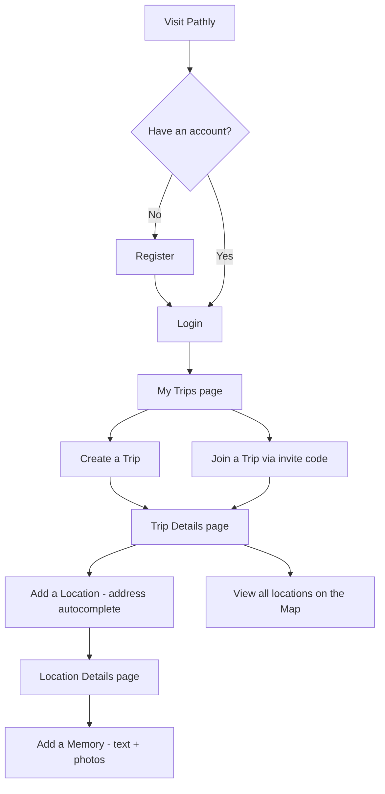
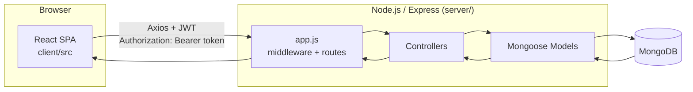
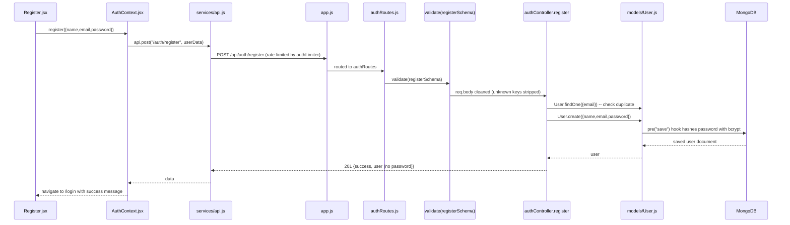
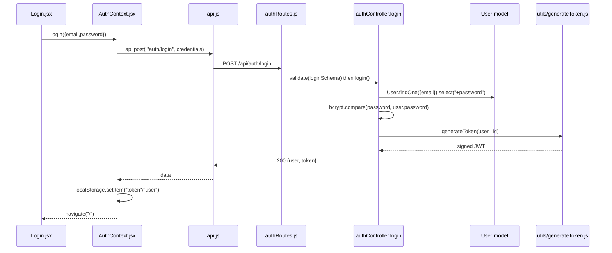
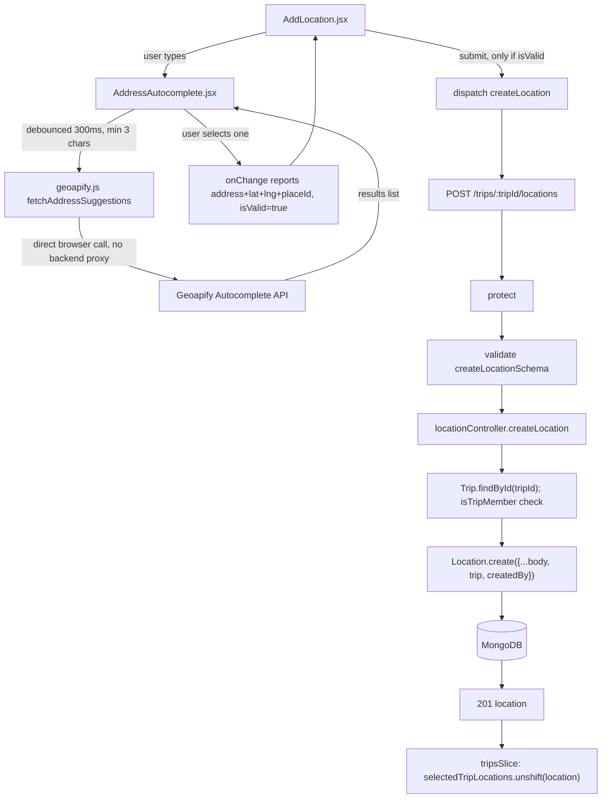

# 🧭 Pathly — Oral Defense Study Guide

> **What this document is:** a study book, not documentation. Every explanation is built directly from your own repository — real file names, real function names, real Mongoose schemas. Nothing here is generic MERN theory disconnected from your code. If a lecturer opens a file, this book tells you what's in it and why.

> **How to use it:** read Chapters 1–3 first (the big picture), then Chapter 4 (the theory, taught through your code), then use Chapters 5–10 as revision tools in the days before your defense.

---

## 📚 Table of Contents

1. [Project Overview](#chapter-1-project-overview)
2. [Complete Project Structure](#chapter-2-complete-project-structure)
3. [The Complete Request Flow](#chapter-3-the-complete-request-flow)
4. [Backend & Frontend Fundamentals (Taught Through Pathly)](#chapter-4-backend--frontend-fundamentals)
5. [Where Is Everything? (Lookup Chapter)](#chapter-5-where-is-everything)
6. [Why Did We Choose...? (Comparison Tables)](#chapter-6-why-did-we-choose)
7. [Likely Exam Questions](#chapter-7-likely-exam-questions)
8. [Code Navigation — File by File](#chapter-8-code-navigation)
9. [Defense Cheat Sheets](#chapter-9-defense-cheat-sheets)
10. [Final Review](#chapter-10-final-review)

---

<a id="chapter-1-project-overview"></a>
# 📖 Chapter 1 — Project Overview

## 1.1 What is Pathly?

**Pathly is a collaborative travel-memory journal.** In plain words:

- A user creates a **Trip** ("Summer in Italy").
- Inside that trip, they add **Locations** they actually visited ("Colosseum, Rome").
- Inside each location, they attach **Memories** — a piece of text and optionally photos ("We got lost trying to find this place and it was worth it" + 3 photos).
- A trip can be **shared**: the creator gets a short invite code (e.g. `PTR-7K2A`), and anyone who enters that code becomes a **participant** who can also add locations and memories to the same trip.

So the data has a clear nested shape:

```
User
 └── Trip (created by a user, has participants)
      └── Location (a place visited during that trip)
           └── Memory (text + photos about that place)
```

> 🟦 **Why?** This is the single most important mental model in the whole project. Every authorization rule, every route, every Mongoose `ref` follows this exact chain. If you remember nothing else, remember: **User → Trip → Location → Memory**.

## 1.2 What problem does it solve?

When people travel together, their photos and memories end up scattered — some on one person's phone, some in a group chat, some never written down at all. Pathly gives a group of travelers **one shared, structured place** to record what they did, where, and how it felt — organized by trip and by exact place, not just a flat photo dump.

## 1.3 Why this idea?

It naturally exercises everything a full-stack course wants to see, with a genuine reason for each piece — not a technology-shopping list bolted onto a toy idea:

| Feature needed | Why it belongs in *this* app |
|---|---|
| Auth (JWT) | Memories are personal — you need to know who is asking |
| Nested resources (Trip → Location → Memory) | A natural real-world hierarchy, not invented for demo purposes |
| File upload (Multer) | Photos are core to a "memory" |
| Authorization rules | A shared trip needs real rules about who can edit what |
| External API (Geoapify) + Map (Leaflet) | An address only becomes useful once it's on a map |
| Redux + Context | Two genuinely different categories of state (see Chapter 6) |

## 1.4 Main user flow



## 1.5 Architecture overview

Pathly is a classic **MERN** split, but with a strict rule: **the frontend never talks to MongoDB directly.**



- **`client/`** — a React 19 single-page app built with Vite. Talks to the API only through `client/src/services/api.js` (an Axios instance).
- **`server/`** — an Express 5 REST API. `server/app.js` wires up middleware and routers; `server/server.js` is the actual process entry point that connects to MongoDB first, then starts listening.
- **MongoDB** — reached only through Mongoose models (`server/models/*.js`). No raw queries, no other database driver.

> 🟨 **Exam Tip:** If asked "does your frontend ever talk to the database?" the answer is an unambiguous **no**, and you can point to `client/src/services/api.js` — the *only* place the client makes network calls, and it only ever calls `server/app.js`'s routes.

## 1.6 The four resources at a glance

| Resource | Model file | Owned by | Contains |
|---|---|---|---|
| **User** | `server/models/User.js` | — | name, email, hashed password, role |
| **Trip** | `server/models/Trip.js` | `createdBy` (User) | title, destination, dates, `participants[]`, `inviteCode` |
| **Location** | `server/models/Location.js` | `createdBy` (User), belongs to `trip` | address, optional title, lat/lng, coverImage |
| **Memory** | `server/models/Memory.js` | `createdBy` (User), belongs to `location` | text `content`, `images[]`, `videos[]` |

---

<a id="chapter-2-complete-project-structure"></a>
# 🗂️ Chapter 2 — Complete Project Structure

> 🟩 **Why?** A lecturer will very likely ask "walk me through your folders." This chapter is written so you can literally read it out loud as an answer.

## 2.1 Root

```
Adv.FullStack/
├── client/                  ← React frontend (Vite)
├── server/                  ← Express backend (API)
├── docs/                    ← Project documentation (this guide lives here)
├── api-tests.rest           ← Manual REST Client test file (no automated tests)
├── MANUAL_TEST_PLAN.md       ← Manual QA checklist
└── README.md                ← Project overview, setup instructions
```

**Why split `client/` and `server/` at the root?** They are two independent Node.js projects with their own `package.json`, own dependencies, and own deployment targets (client → static hosting like Vercel/Netlify, server → a Node host like Heroku). Keeping them siblings, not nested, means neither accidentally imports from the other and each can be deployed on its own.

## 2.2 Backend: `server/`

```
server/
├── server.js                 ← Entry point: loads .env, connects DB, THEN starts listening
├── app.js                    ← Express app: middleware + route wiring (no listen() here)
├── config/
│   └── db.js                 ← Mongoose connection logic
├── controllers/               ← Business logic, one file per resource
│   ├── authController.js      (register, login, getMe)
│   ├── userController.js      (admin/self user management)
│   ├── tripController.js      (CRUD + joinTrip)
│   ├── locationController.js  (CRUD, nested under a trip)
│   └── memoryController.js    (CRUD + image upload/remove)
├── routes/                    ← Express routers, only wiring — no logic
│   ├── authRoutes.js
│   ├── userRoutes.js
│   ├── tripRoutes.js
│   ├── locationRoutes.js      (exports TWO routers — see Ch.3/Ch.8)
│   └── memoryRoutes.js        (exports TWO routers — see Ch.3/Ch.8)
├── middleware/
│   ├── authMiddleware.js       (protect — verifies JWT)
│   ├── memoryAuth.js           (authorizeMemoryImageUpload — pre-Multer auth)
│   ├── validate.js             (generic Joi-schema-runner middleware)
│   ├── upload.js                (Multer configuration)
│   ├── rateLimiter.js           (apiLimiter, authLimiter)
│   └── errorHandler.js          (global error handler — always LAST)
├── models/                     ← Mongoose schemas only
│   ├── User.js
│   ├── Trip.js
│   ├── Location.js
│   └── Memory.js
├── validation/                 ← Joi schemas only (no DB, no HTTP)
│   ├── authValidation.js
│   ├── tripValidation.js
│   ├── locationValidation.js
│   └── memoryValidation.js
├── utils/                      ← Small, reusable, framework-agnostic helpers
│   ├── generateToken.js         (signs a JWT)
│   ├── generateInviteCode.js    (random "PTR-XXXX" code)
│   ├── tripMembership.js        (isTripMember — single source of truth)
│   ├── cascadeDelete.js         (deleteLocationsForTrip, deleteMemoriesForLocation)
│   └── mediaCleanup.js          (safe file deletion in server/uploads/)
├── uploads/                    ← Uploaded memory images (gitignored, created at runtime)
└── .env / .env.example          ← MONGO_URI, JWT_SECRET, JWT_EXPIRES_IN, PORT, CLIENT_URL
```

### Why this exact separation? (MVC, explained with your files)

> 🟦 **Why?** This is literally the **Model-View-Controller** pattern (minus "View" — an API has no view, it returns JSON that React renders instead).

| Layer | Folder | Job | Must NOT contain |
|---|---|---|---|
| **Routes** | `routes/` | Map an HTTP verb + path to a controller function, attach middleware in the right order | Business logic, database queries |
| **Controllers** | `controllers/` | Business logic: what happens when this request arrives | Raw `app.use()` wiring, Mongoose schema definitions |
| **Models** | `models/` | Define the shape of data and its database-level rules | HTTP concepts (`req`, `res`), business/authorization logic |
| **Validation** | `validation/` | Define what a *valid request body* looks like (Joi) | Database access |
| **Middleware** | `middleware/` | Cross-cutting request processing (auth, rate limits, file parsing, errors) | Resource-specific business logic |
| **Utils** | `utils/` | Small pure/reusable helpers shared by more than one controller | HTTP req/res handling |

> 🟥 **Common Mistake:** Putting a database query directly inside a route file (`router.get("/", async (req,res) => { await Trip.find() ... })`). Pathly never does this — every route file only imports and wires functions from a controller. If your lecturer opens any `routes/*.js` file, you should be able to say: "this file has zero business logic, it only wires HTTP verbs to controller functions."

## 2.3 Frontend: `client/src/`

```
client/src/
├── main.jsx                   ← Real entry point: mounts <App/> inside Router+Redux Provider+AuthProvider+ErrorBoundary
├── App.jsx                     ← All routes (React Router), lazy-loaded pages, Suspense fallback
├── index.css / App.css          ← Global styles
├── context/
│   └── AuthContext.jsx          ← Auth state via React Context (user, token, login, logout...)
├── store/
│   ├── store.js                 ← configureStore({ trips, memories })
│   └── slices/
│       ├── tripsSlice.js         ← Redux Toolkit slice: trips + locations-under-a-trip
│       └── memoriesSlice.js      ← Redux Toolkit slice: memories + image upload/remove
├── services/
│   ├── api.js                    ← Axios instance to OUR backend (adds JWT, handles 401, resolveMediaUrl)
│   └── geoapify.js                ← Separate Axios instance straight to Geoapify (no JWT, no our backend)
├── pages/                        ← One component per route
│   ├── Home.jsx
│   ├── Login.jsx / Register.jsx
│   ├── MyTrips.jsx
│   ├── CreateTrip.jsx
│   ├── TripDetails.jsx
│   ├── AddLocation.jsx
│   ├── LocationDetails.jsx
│   ├── Map.jsx
│   └── NotFound.jsx
├── components/
│   ├── layout/
│   │   ├── AppLayout.jsx          (Navbar + <Outlet/> + Footer shell)
│   │   ├── Navbar.jsx
│   │   └── Footer.jsx
│   ├── common/
│   │   ├── ProtectedRoute.jsx      (client-side route guard)
│   │   ├── ErrorBoundary.jsx       (class component — catches render crashes)
│   │   ├── ImageLightbox.jsx        (full-size image viewer, uses a Portal)
│   │   └── ScrollToTop.jsx
│   ├── trips/
│   │   ├── TripCard.jsx  (React.memo)
│   │   ├── LocationCard.jsx (React.memo)
│   │   ├── JoinTripModal.jsx
│   │   └── ParticipantsModal.jsx
│   ├── locations/
│   │   └── AddressAutocomplete.jsx  (Geoapify-powered address field)
│   └── memories/
│       ├── MemoriesSection.jsx
│       └── MemoryCard.jsx (React.memo)
├── hooks/
│   └── useBodyScrollLock.js        ← Custom Hook: locks page scroll while a modal/lightbox is open
└── utils/
    └── normalizeId.js               ← getEntityId, isSameEntity, getTravelerCount, getTravelerList
```

### Why this exact separation? (frontend responsibilities)

| Folder | Responsibility | Why separated |
|---|---|---|
| `pages/` | One component per **route** — the "screen" | Matches React Router structure 1:1; easy to lazy-load per route |
| `components/` | Reusable pieces used **inside** pages, grouped by domain (`trips/`, `memories/`, `locations/`) or by role (`layout/`, `common/`) | A `TripCard` is used both in `MyTrips.jsx` and conceptually could appear elsewhere — it doesn't belong to one page |
| `context/` | Global state that changes rarely, read everywhere (auth) | See Ch.6 — Context vs Redux |
| `store/` | Global state with many independent async operations, each needing its own loading/error flags (trips, memories) | Same reason, opposite conclusion — see Ch.6 |
| `services/` | All outgoing HTTP — nothing else imports `axios` directly | One place to add the JWT header, handle 401, and know the API base URL |
| `hooks/` | Logic that isn't UI, reused by more than one component | `useBodyScrollLock` was extracted from `ImageLightbox` for exactly this reason |
| `utils/` | Pure helper functions, no React, no side effects | `normalizeId.js` has zero JSX and zero hooks — just functions |

---

<a id="chapter-3-the-complete-request-flow"></a>
# 🔄 Chapter 3 — The Complete Request Flow

> 🟦 This is the chapter to master cold. For each flow: UI file → state layer → Axios → Express → route → middleware chain → controller → model → MongoDB → response → state update → re-render.

## 3.1 Register



| Step | File | Responsibility |
|---|---|---|
| 1 | `client/src/pages/Register.jsx` | Collects name/email/password/confirmPassword, checks passwords match locally |
| 2 | `client/src/context/AuthContext.jsx` `register()` | Calls the API, manages `loading`/`error` |
| 3 | `client/src/services/api.js` | Axios instance — attaches nothing here (no token exists yet) |
| 4 | `server/app.js` | `apiLimiter` then `authLimiter` on `/api/auth/register` specifically |
| 5 | `server/routes/authRoutes.js` | `POST /register` → `validate(registerSchema)` → `register` |
| 6 | `server/validation/authValidation.js` | Joi: name 2–50 chars, valid email, password ≥ 6 chars |
| 7 | `server/controllers/authController.js` `register` | Checks for existing email (409 if found), creates the user |
| 8 | `server/models/User.js` | `pre("save")` hook hashes password with `bcrypt.hash(password, 10)` |
| 9 | Response | `formatUser()` strips the password out of the response — never sent back, ever |

> 🟥 **Common Mistake:** Thinking the password is hashed in the controller. It is **not** — `authController.register` just calls `User.create(...)`. The hashing happens inside the **Mongoose schema's own pre-save hook**, so it's impossible to accidentally save a user anywhere in the codebase with a plaintext password.

## 3.2 Login



**Key detail:** `User.js` marks `password: { select: false }`, so *every* normal query (`User.find()`, `findById()`) never returns the password field — **except** here, where `authController.login` explicitly asks for it with `.select("+password")`, because it's the one place that genuinely needs to compare it.

> 🟨 **Exam Tip:** If asked "why doesn't `getMe` leak the password", the answer is: it doesn't need `.select("+password")`, so the schema's default (`select:false`) silently excludes it. Security by default, not by remembering to strip it every time.

## 3.3 Create Trip

```
CreateTrip.jsx (form state)
  ↓ dispatch(createTrip(tripData))
tripsSlice.js  createAsyncThunk → api.post("/trips", tripData)
  ↓ Authorization: Bearer <token>  (added by api.js request interceptor)
app.js → apiLimiter → /api/trips → tripRoutes.js
  ↓
protect (authMiddleware.js) → verifies JWT, loads req.user
  ↓
validate(createTripSchema) (tripValidation.js) → checks title/destination/dates
  ↓
tripController.createTrip
  ↓
Trip.create({ ...body, createdBy: req.user._id, participants: [req.user._id] })
  ↓ Trip.js schema: inviteCode auto-generated via generateInviteCode() default
MongoDB
  ↓
201 { trip }
  ↓
tripsSlice: createTrip.fulfilled → state.items.unshift(trip)
  ↓
MyTrips.jsx re-renders (via useSelector) with the new trip at the top
```

> 🟦 **Why does the creator get put into `participants` too?** So a single membership check (`isTripMember`) works for both the creator and joined users — see `utils/tripMembership.js`. No special-casing "or is this the creator" everywhere.

## 3.4 Join Trip

```
JoinTripModal.jsx → dispatch(joinTrip(inviteCode))
  ↓
tripsSlice.joinTrip thunk → POST /trips/join { inviteCode }
  ↓
protect → validate(joinTripSchema)  (Joi regex: /^PTR-[A-Z0-9]{3,12}$/)
  ↓
tripController.joinTrip:
  1. Trip.findOne({ inviteCode })            → 404 if not found
  2. check trip.participants already has req.user._id → 400 if already joined
  3. trip.participants.push(req.user._id); trip.save()
  ↓
200 { trip }  →  Redux unshifts trip into items (if not already present)
  ↓
setTimeout 900ms → navigate(`/trips/${trip._id}`)
```

## 3.5 Create Location (with Address Autocomplete)



**Files involved, in order:** `AddLocation.jsx` → `AddressAutocomplete.jsx` → `services/geoapify.js` → `store/slices/tripsSlice.js` (`createLocation` thunk) → `services/api.js` → `server/app.js` → `server/routes/locationRoutes.js` (`tripLocationRouter`) → `authMiddleware.js` → `validate(createLocationSchema)` → `locationController.js` `createLocation` → `models/Location.js` → MongoDB.

> 🟥 **Common Mistake:** Believing the address autocomplete request goes through the Pathly backend. It does **not** — `services/geoapify.js` calls `https://api.geoapify.com` directly from the browser. Only the *final* location data (already resolved) is sent to Pathly's own backend.

## 3.6 Address Autocomplete (detailed)

1. User types in `AddressAutocomplete.jsx`'s input.
2. On every keystroke, `handleInputChange` compares the new text to `lastValidPlaceRef.current.address` (the last *confirmed* selection).
3. If it doesn't match, the component reports `isValid: false` upward and clears lat/lng — this is how Pathly guarantees a saved location can never have coordinates for an address the user typed but didn't actually select.
4. After a 300ms debounce, `fetchAddressSuggestions()` (in `geoapify.js`) calls Geoapify directly; results render in an accessible `listbox`.
5. Selecting a suggestion calls `selectSuggestion()`, which stores the confirmed address+lat+lng+placeId in `lastValidPlaceRef` and reports `isValid: true`.
6. If Geoapify is unconfigured or errors, the component gracefully degrades to plain-text entry (`isValid: true`, no coordinates) rather than blocking the form.

## 3.7 Map Marker Rendering

```
Map.jsx mounts
  ↓ dispatch(fetchTrips())                         → Redux: all accessible trips
  ↓ for EACH trip: api.get(`/trips/${id}/locations`)  → plain axios calls (not Redux — local state)
  ↓ Promise.allSettled(...) merges into locationsByTrip
  ↓ visibleLocations = useMemo(...) filters out any location missing valid finite lat/lng
  ↓ <MapContainer> (react-leaflet) renders <TileLayer> (OpenStreetMap) + one <Marker> per visible location
  ↓ <FitBoundsToMarkers> (child using useMap()) recenters/zooms the map whenever the marker set changes
  ↓ clicking a marker's popup "View location" → navigates to /locations/:id
```

> 🟨 **Exam Tip:** There is **no bulk "all my locations" endpoint**. `Map.jsx` reuses the exact same `GET /trips/:tripId/locations` endpoint `TripDetails.jsx` uses, just called once per trip in parallel. This is a deliberate reuse decision, not an oversight — explained in the code comments in `Map.jsx`.

## 3.8 Create Memory

```
LocationDetails.jsx renders <MemoriesSection locationId=.../>
  ↓
MemoriesSection.jsx: dispatch(createMemory({ locationId, content }))
  ↓ memoriesSlice.js thunk → POST /locations/:locationId/memories { content }
  ↓
protect → validate(createMemorySchema)  (content required, 1–2000 chars; images/videos NOT accepted here)
  ↓
memoryController.createMemory:
  1. Location.findById(locationId)      → 404 if missing
  2. Trip.findById(location.trip)        → walk up to the trip
  3. isTripMember(trip, req.user._id)    → 403 if not a member
  4. Memory.create({ content, location: locationId, createdBy: req.user._id })
  5. memory.populate("createdBy","name")  → so the UI shows a name immediately, no refetch needed
  ↓
201 { memory }  → memoriesSlice: items.unshift(memory)
```

> 🟦 **Why is `images` rejected by `createMemorySchema`?** So a JSON client can never sneak arbitrary path strings into `images` directly. Images are **only** ever added through the dedicated Multer upload endpoint below, which writes real files to disk first.

## 3.9 Upload Image (to an existing Memory)

```mermaid
sequenceDiagram
    participant UI as MemoriesSection.jsx / MemoryCard.jsx
    participant Slice as memoriesSlice.js
    participant Route as memoryRoutes.js
    participant Auth as memoryAuth.js (authorizeMemoryImageUpload)
    participant Multer as upload.js (uploadImages)
    participant Ctrl as memoryController.uploadMemoryImages
    participant Disk as server/uploads/

    UI->>Slice: dispatch(uploadMemoryImages({memoryId, files}))
    Slice->>Route: POST /memories/:id/images (FormData, NOT JSON)
    Route->>Auth: protect, then authorizeMemoryImageUpload
    Note over Auth: Loads Memory BEFORE Multer touches disk.<br/>Rejects (403) if not the memory's creator.
    Auth->>Multer: req.memory attached, next()
    Multer->>Disk: writes files, generates unique name Date.now()-random.ext
    Multer->>Ctrl: req.files populated
    Ctrl->>Ctrl: memory.images.push(...imagePaths); memory.save()
    alt save fails
        Ctrl->>Disk: deleteFilesByAbsolutePath(req.files) - rollback orphan files
    end
    Ctrl-->>UI: 200 { images, memory }
```

> 🟥 **Common Mistake:** Assuming authorization happens *inside* the controller here. It's the opposite — `authorizeMemoryImageUpload` (in `middleware/memoryAuth.js`) runs **before** Multer even parses the request, specifically so an unauthorized request can never cause a single byte to be written to disk.

## 3.10 Delete Image

```
MemoryCard.jsx → confirm() → dispatch(removeMemoryImage({memoryId, filename}))
  ↓ DELETE /memories/:id/images/:filename
  ↓ protect → memoryController.removeMemoryImage
  ↓ path.basename(filename) — strips any "../" traversal attempt, rejects if it changes the string
  ↓ confirms creator ownership (403 otherwise)
  ↓ memory.images.splice(index,1); memory.save()   ← DB updated FIRST
  ↓ deleteLocalUploadedFiles([storedPath])           ← file deleted from disk AFTER save succeeds
  ↓ 200 { memory }
```

> 🟦 **Why DB-first, then disk?** If the database save fails, no reason to have already deleted the file — the response never claims success while the underlying data is inconsistent. A failed disk delete afterward is only logged, never fails the request (the DB is the source of truth for what a memory "has").

## 3.11 Logout

```
Navbar.jsx dropdown → logout() (from AuthContext)
  ↓ localStorage.removeItem("token" / "user")
  ↓ setToken(null); setUser(null)
  ↓ navigate("/login", { replace: true })   ← happens in the SAME tick as the state update
```

> 🟨 **Exam Tip:** The code comment in `AuthContext.jsx` explains *why* `navigate` is called explicitly here rather than relying on `ProtectedRoute` to redirect naturally: without it, a very specific bug could leak one user's last visited protected route into the next person's login redirect. Worth quoting if asked "walk me through a subtle bug you fixed."

## 3.12 Full request flow — generic template

Whenever asked "what happens when X happens," answer using this universal skeleton (every flow above follows it):

```
[Page component] (React state / form)
        ↓
[Redux slice thunk]  OR  [direct api.* call]
        ↓
services/api.js  (attaches JWT via request interceptor)
        ↓
server/app.js  (helmet → rate limiter → cors → express.json → routes)
        ↓
[resource]Routes.js  (only wiring)
        ↓
protect  (authMiddleware.js — authentication: who are you?)
        ↓
validate([resource]Schema)  (Joi — is this body well-formed?)
        ↓
[resource]Controller.js  (authorization: are you allowed? + business logic)
        ↓
Mongoose Model  (schema-level rules, e.g. password hashing, required fields)
        ↓
MongoDB
        ↓
JSON response { success, ... }
        ↓
Redux reducer / component state update
        ↓
React re-renders
```

---

<a id="chapter-4-backend--frontend-fundamentals"></a>
# 🎓 Chapter 4 — Backend & Frontend Fundamentals (Taught Through Pathly)

Each concept below follows the same structure: **Definition → Why it exists → Where in Pathly → Example → Exam Qs → Common Mistakes.**

## 4.1 Node.js

**Definition:** Node.js is a JavaScript runtime that runs JS outside a browser, so the same language can power a server.

**Why needed:** Pathly's entire backend (`server/`) is a Node.js process — `server/server.js` is literally the file you run with `node server.js`.

**Where:** `server/package.json` → `"scripts": { "start": "node server.js", "dev": "nodemon server.js" }`.

> ❓ **Exam Q:** What's the difference between `npm start` and `npm run dev` in your server? **A:** `start` runs plain `node` (production-style, no auto-restart); `dev` runs `nodemon`, which restarts the process automatically on file changes — used only during development.

## 4.2 Express

**Definition:** A minimal web framework on top of Node's raw HTTP module — gives you routing, middleware, and request/response helpers instead of parsing raw sockets yourself.

**Where:** `server/app.js` creates the app with `const app = express()`, then layers on middleware and routers.

**Why:** Without Express, you'd manually parse URLs, methods, and bodies for every single endpoint. Express turns that into `app.use("/api/trips", tripRoutes)`.

## 4.3 REST API

**Definition:** An architectural style where resources (nouns: trips, locations) are addressed by URL, and actions are expressed with HTTP verbs (GET/POST/PUT/DELETE), not verbs in the URL.

**Where in Pathly (from `server/routes/tripRoutes.js`):**

| Verb | Path | Meaning |
|---|---|---|
| POST | `/api/trips` | create a trip |
| GET | `/api/trips` | list my trips |
| GET | `/api/trips/:id` | get one trip |
| PUT | `/api/trips/:id` | update a trip |
| DELETE | `/api/trips/:id` | delete a trip |
| POST | `/api/trips/join` | join via invite code |

> 🟥 **Common Mistake:** Calling `/api/trips/delete/:id` a "RESTful route." It isn't — REST expresses the action through the **verb** (`DELETE`), not through a word in the path.

## 4.4 MVC (Model–View–Controller)

Already covered in depth in Chapter 2.3 table. One line to memorize: **"Routes wire, Controllers decide, Models define."**

## 4.5 Routes

**Definition:** The layer that maps an HTTP method + path to a handler function (and attaches any needed middleware).

**Example — `server/routes/authRoutes.js`:**
```js
router.post("/register", validate(registerSchema), register);
router.post("/login", validate(loginSchema), login);
router.get("/me", protect, getMe);
```
Notice: no logic, just composition of functions imported from elsewhere.

## 4.6 Controllers

**Definition:** Functions that receive `(req, res, next)` and contain the actual decision-making for one endpoint.

**Example — `tripController.deleteTrip`:** finds the trip *scoped to the current user as creator* (`Trip.findOne({_id, createdBy: req.user._id})`), cascades deletion of its locations/memories/files, then deletes the trip. If no matching trip exists (wrong id, or not the creator), it returns 404 rather than a 403 — deliberately not confirming to a non-creator that the trip even exists in a different form.

## 4.7 Models

**Definition:** A Mongoose "Model" is a JS class generated from a Schema, giving you `.find()`, `.create()`, `.save()`, etc. against one MongoDB collection.

**Example — `server/models/User.js`:** defines `name`, `email` (unique), `password` (`select:false`), `role` (default `"user"`), plus a `pre("save")` hook.

## 4.8 MongoDB

**Definition:** A document-oriented NoSQL database — stores JSON-like documents (BSON) instead of rows in tables.

**Why for Pathly:** The data is naturally nested/hierarchical (Trip→Location→Memory) and the schema evolved over the project's life (see the `placeName`/`googlePlaceId` legacy-but-kept-optional fields in `Location.js`) — a flexible document model tolerates that evolution more gracefully than a rigid SQL migration would have, for a project of this size and timeline.

## 4.9 Mongoose

**Definition:** An Object Data Modeling (ODM) library that sits between your Node code and MongoDB's driver, giving you schemas, validation, middleware (hooks), and a nicer query API.

**Where:** every file in `server/models/`, plus `server/config/db.js` (`mongoose.connect(...)`).

## 4.10 ObjectId

**Definition:** MongoDB's default unique identifier type for a document (`_id`), a 12-byte value, usually represented as a 24-character hex string.

**Where used:** every `ref` field — e.g. `Trip.createdBy: { type: mongoose.Schema.Types.ObjectId, ref: "User" }`. Comparisons between an ObjectId and a string must use `.toString()` — see `location.createdBy.toString() === req.user._id.toString()` throughout the controllers, and the whole reason `utils/normalizeId.js` exists on the frontend (an ObjectId can arrive as a raw string OR a populated object).

## 4.11 `populate`

**Definition:** Mongoose's way of "joining" a referenced document's data into the result, replacing an ObjectId with the actual referenced document (or selected fields of it).

**Example — `tripController.getTrips`:**
```js
Trip.find({...}).populate("createdBy", "name").populate("participants", "name")
```
This turns `createdBy: "64f2..."` into `createdBy: { _id: "64f2...", name: "Yamit" }` — so the frontend never needs a second request just to show a name.

> 🟨 **Exam Tip:** Populate happens at **query time**, not automatically. If you forget `.populate(...)`, you get a raw ObjectId string, not an error.

## 4.12 Validation (Joi)

**Definition:** A schema-based request-body validator — describes exactly which fields are allowed and what shape they must have, rejecting anything else *before* it reaches business logic.

**Where:** `server/validation/*.js` + the generic `server/middleware/validate.js`:
```js
const { error, value } = schema.validate(req.body, { abortEarly: false, stripUnknown: true });
```
`stripUnknown: true` is important — an attacker sending `{ role: "admin" }` on registration simply has that field silently dropped, not rejected-then-trusted.

## 4.13 JWT (JSON Web Token)

**Definition:** A signed (not necessarily encrypted) token encoding a claim ("this is user X") that the server can verify without a database lookup for its authenticity, only its signature.

**Where signed:** `utils/generateToken.js` — `jwt.sign({ id: userId }, process.env.JWT_SECRET, { expiresIn: process.env.JWT_EXPIRES_IN })`.

**Where verified:** `middleware/authMiddleware.js`'s `protect` — `jwt.verify(token, process.env.JWT_SECRET)`, then loads the actual user from MongoDB (`User.findById(decoded.id)`), because the token only proves identity, not that the account still exists.

**Where stored/sent:** the client stores it in `localStorage` (`AuthContext.jsx`); `services/api.js`'s request interceptor attaches `Authorization: Bearer <token>` to every outgoing request.

## 4.14 bcrypt

**Definition:** A slow, salted hashing algorithm purpose-built for passwords — "slow" is a *feature* (resists brute-force), unlike a fast hash like SHA-256.

**Where:** `models/User.js`'s pre-save hook (`bcrypt.hash(password, 10)` — 10 = cost factor/rounds) and `authController.login` (`bcrypt.compare(password, user.password)`).

## 4.15 Authentication vs Authorization

Already summarized in the existing project cheat sheet, and it's important enough to repeat here precisely:

- **Authentication** = "who are you?" → one universal check: the `protect` middleware, same for every protected route.
- **Authorization** = "are *you specifically* allowed to do *this specific thing*?" → checked separately, per action, inside each controller (`isTripMember` for reads, exact `createdBy` match for writes).

## 4.16 Multer

**Definition:** Express middleware for parsing `multipart/form-data` (file uploads), since `express.json()` cannot parse binary file bodies.

**Where:** `middleware/upload.js` — `multer.diskStorage` writes to `server/uploads/`, filenames are `Date.now()-<random>.ext`; `fileFilter` only allows JPEG/PNG/WebP; `limits: { fileSize: 5MB, files: 5 }`.

## 4.17 Global Error Handler

**Definition:** A single Express middleware, registered **last**, with the special 4-argument signature `(err, req, res, next)`, that every `next(error)` call in the app eventually reaches.

**Where:** `middleware/errorHandler.js` — translates Mongoose `CastError`/`ValidationError`, duplicate-key `11000`, JWT errors, and Multer errors into consistent `{ success:false, message }` JSON with the right status code.

> 🟥 **Common Mistake:** Registering `errorHandler` before your routes. Express error middleware only catches errors from routes/middleware registered **before** it — `app.js` explicitly comments "must always be registered last."

## 4.18 Helmet

**Definition:** Middleware that sets a bundle of security-related HTTP response headers.

**Where:** `app.use(helmet())` in `app.js`, plus one deliberate override: the `/uploads` static route sets `Cross-Origin-Resource-Policy: cross-origin` because Helmet's default (`same-origin`) would otherwise block the React app (different origin) from loading `` tags pointing at the backend.

## 4.19 Rate Limiting

**Definition:** Middleware that caps how many requests a single client (by IP) can make in a time window.

**Where:** `middleware/rateLimiter.js` — `apiLimiter` (general, 100/15min prod) applied to all of `/api`; `authLimiter` (stricter, 10/15min prod) applied *specifically* to `/api/auth/login` and `/api/auth/register`, because those are the endpoints an attacker would actually script against (credential stuffing / spam signups).

## 4.20 Geoapify

**Definition:** A geocoding/places API — Pathly uses only its **Address Autocomplete** endpoint (`/v1/geocode/autocomplete`).

**Where:** `client/src/services/geoapify.js` — a *separate* Axios instance from the app's own backend client, called directly from the browser (no backend proxy), because there's no security reason to hide a public, referrer-restrictable browser key.

## 4.21 Leaflet + OpenStreetMap

**Definition:** Leaflet is an open-source JS mapping library; `react-leaflet` wraps it in React components (`MapContainer`, `TileLayer`, `Marker`, `Popup`); the map tiles themselves come from OpenStreetMap, which needs no API key.

**Where:** `client/src/pages/Map.jsx`.

## 4.22 Context (React Context API)

**Definition:** A way to share a value across a component tree without manually passing props down through every level ("prop drilling").

**Where:** `client/src/context/AuthContext.jsx` — provides `user`, `token`, `isAuthenticated`, `login`, `register`, `logout` to the entire app via `<AuthProvider>` in `main.jsx`.

**Full reasoning: see Chapter 6 (Context vs Redux).**

## 4.23 Redux (Redux Toolkit)

**Definition:** A predictable state container — one central `store`, updated only through dispatched `actions`, read via `useSelector`.

**Where:** `client/src/store/` — `tripsSlice.js` and `memoriesSlice.js`, each built with `createSlice` + `createAsyncThunk` (handles the pending/fulfilled/rejected lifecycle of an async API call automatically).

## 4.24 `React.memo`

**Definition:** A higher-order component that skips re-rendering a component if its props haven't changed (shallow comparison).

**Where:** `TripCard.jsx`, `LocationCard.jsx`, `MemoryCard.jsx` are all wrapped: `export default memo(TripCard)`. These render inside lists (`.map()`), so when one item's state changes, `memo` prevents every *other* card in the list from needlessly re-rendering.

## 4.25 Lazy Loading

**Definition:** Deferring loading a piece of code until it's actually needed, so the initial bundle is smaller.

**Where:** `client/src/App.jsx` — every page component is imported with `lazy(() => import("./pages/Home"))` and wrapped in a single `<Suspense fallback={<PageLoader/>}>`. A user visiting `/login` never downloads the Map page's Leaflet code.

## 4.26 Error Boundary

**Definition:** A React class component implementing `static getDerivedStateFromError` and/or `componentDidCatch`, which catches JS errors thrown *during rendering* anywhere in its child tree and shows a fallback UI instead of an unhandled crash (blank white page).

**Where:** `client/src/components/common/ErrorBoundary.jsx`, wrapped around `<App/>` in `main.jsx`. **Important nuance:** it does **not** catch failed API calls — those are ordinary caught promise rejections handled per-page (e.g. `TripDetails`'s own error state). It only catches genuine rendering bugs.

## 4.27 Custom Hook

**Definition:** A plain JS function whose name starts with `use` and that calls other Hooks internally — a way to extract and reuse stateful logic between components.

**Where:** `client/src/hooks/useBodyScrollLock.js` — locks/unlocks `document.body.style.overflow` for as long as a boolean `active` flag is true; used by `ImageLightbox.jsx` so the page behind a full-screen image can't scroll.

---

<a id="chapter-5-where-is-everything"></a>
# 🔍 Chapter 5 — Where Is Everything? (Lookup Chapter)

| Question | File | Answer |
|---|---|---|
| Where is a JWT **created**? | `server/utils/generateToken.js` | `jwt.sign({id:userId}, JWT_SECRET, {expiresIn: JWT_EXPIRES_IN})`, called from `authController.login` |
| Where is a JWT **verified**? | `server/middleware/authMiddleware.js` (`protect`) | `jwt.verify(token, JWT_SECRET)`, then loads the user from Mongo |
| Where is the password **hashed**? | `server/models/User.js` | `pre("save")` hook, `bcrypt.hash(password, 10)` |
| Where is the password **compared** at login? | `server/controllers/authController.js` (`login`) | `bcrypt.compare(password, user.password)` |
| Where are trips **saved**? | `server/controllers/tripController.js` (`createTrip`) → `Trip.create(...)` | Model: `server/models/Trip.js` |
| Where are images **uploaded to disk**? | `server/middleware/upload.js` | `multer.diskStorage`, destination `server/uploads/` |
| Where is an image upload **authorized**? | `server/middleware/memoryAuth.js` (`authorizeMemoryImageUpload`) | Runs *before* Multer |
| Where are coordinates **stored**? | `server/models/Location.js` | `lat`, `lng` (Number, optional) |
| Where are coordinates **captured**? | `client/src/components/locations/AddressAutocomplete.jsx` | Only on selecting a Geoapify suggestion |
| Where does Redux **update trips**? | `client/src/store/slices/tripsSlice.js` | `extraReducers` per thunk (`createTrip.fulfilled`, etc.) |
| Where is authentication **checked** (backend)? | `server/middleware/authMiddleware.js` (`protect`) | Applied on nearly every route except register/login/health |
| Where is authentication **checked** (frontend)? | `client/src/components/common/ProtectedRoute.jsx` | Redirects to `/login` if `!isAuthenticated` |
| Where are trip **permissions** checked? | `server/utils/tripMembership.js` (`isTripMember`) | Used in location/memory controllers for reads |
| Where are **creator-only** permissions checked? | Inline in each controller | e.g. `location.createdBy.toString() === req.user._id.toString()` |
| Where is **Join Trip** implemented? | Backend: `tripController.joinTrip` + `tripRoutes.js` `POST /join` · Frontend: `JoinTripModal.jsx` + `tripsSlice.js` (`joinTrip` thunk) | |
| Where is the **invite code generated**? | `server/utils/generateInviteCode.js` | Used as `Trip.js` schema's `inviteCode` default |
| Where is **cascade delete** implemented? | `server/utils/cascadeDelete.js` | `deleteLocationsForTrip`, `deleteMemoriesForLocation` |
| Where are orphan **files cleaned up**? | `server/utils/mediaCleanup.js` | `deleteLocalUploadedFiles`, `deleteFilesByAbsolutePath` |
| Where is the **global error handler**? | `server/middleware/errorHandler.js` | Registered last in `app.js` |
| Where is **rate limiting** configured? | `server/middleware/rateLimiter.js` | Applied in `app.js` |
| Where does the client attach the **JWT header**? | `client/src/services/api.js` | Axios request interceptor |
| Where does the client handle a **401**? | `client/src/services/api.js` | Response interceptor — clears storage, redirects to `/login` |
| Where does the client build an **image URL**? | `client/src/services/api.js` (`resolveMediaUrl`) | Combines `/uploads/<file>` with the API's origin |
| Where is the **map rendered**? | `client/src/pages/Map.jsx` | `react-leaflet`'s `MapContainer`/`TileLayer`/`Marker` |
| Where is **address autocomplete** called? | `client/src/services/geoapify.js` | Direct browser → Geoapify, no backend proxy |
| Where is a **route protected** (React Router)? | `client/src/App.jsx` | Wrapping element `<ProtectedRoute>` |
| Where is the **Redux store** assembled? | `client/src/store/store.js` | `configureStore({ reducer: { trips, memories } })` |
| Where is **auth state** provided globally? | `client/src/context/AuthContext.jsx` | `<AuthProvider>` in `main.jsx` |
| Where is a **404 route** handled (frontend)? | `client/src/App.jsx` | Final `<Route path="*" element={<NotFound/>}/>` |
| Where is an **unknown backend route** handled? | `server/app.js` | Catch-all middleware before `errorHandler`, sets `statusCode = 404` |

---

<a id="chapter-6-why-did-we-choose"></a>
# ⚖️ Chapter 6 — Why Did We Choose...?

## 6.1 JWT vs Sessions

| | JWT (Pathly's choice) | Server-side sessions |
|---|---|---|
| State | Stateless — server verifies signature, no session store needed | Stateful — server must store session data (memory/DB/Redis) |
| Scaling | Easy — any server instance can verify the same token | Needs shared session storage across instances |
| Revocation | Harder — a token is valid until it expires | Easy — just delete the session server-side |
| Pathly's actual use | `Authorization: Bearer <token>` header, verified in `protect` | Not used |

**Why Pathly uses JWT:** no server-side session storage to manage, simple to attach via an Axios interceptor, and this is the standard MERN pattern this course expects.

## 6.2 Context vs Redux

| | Context (`AuthContext.jsx`) | Redux (`tripsSlice.js`, `memoriesSlice.js`) |
|---|---|---|
| Data | Auth: current user, token | Domain data: trips, locations, memories |
| Update frequency | Rare (login/logout) | Frequent, many independent async operations |
| Per-operation loading/error state | Not needed — one user, one token | Essential — e.g. `creatingLocation` vs `deletingTrip` must not interfere |
| Middleware / async lifecycle helpers | Not needed | `createAsyncThunk` auto-generates pending/fulfilled/rejected |

**Why both exist side-by-side, not just one:** using Redux for something as simple as "who is logged in" would add unnecessary boilerplate (actions, reducers, a slice) for state that's genuinely simple and rarely changes. Using Context for trips/memories, which need many *independent, simultaneously-in-flight* loading states (fetch vs create vs delete vs upload), would mean hand-rolling exactly what Redux Toolkit already gives you for free.

## 6.3 Leaflet vs Google Maps

| | Leaflet + OpenStreetMap (used) | Google Maps (explored, not merged) |
|---|---|---|
| API key required for the map itself | No | Yes |
| Billing account required | No | Yes (Google requires a card on file) |
| Cost at Pathly's scale | Free | Free tier exists but requires billing setup |
| History in this repo | Current, live implementation | Earlier branch, never merged — `googlePlaceId` field kept optional in `Location.js` for backward compatibility only |

## 6.4 MongoDB vs SQL

| | MongoDB (used) | SQL (e.g. PostgreSQL) |
|---|---|---|
| Data shape | Nested/hierarchical documents — natural fit for Trip→Location→Memory | Flat rows + JOINs needed to reconstruct the hierarchy |
| Schema flexibility | Easy to add optional fields later (see `Location.js`'s legacy `placeName`/`googlePlaceId`) without a migration | Requires a migration for every schema change |
| Relationships | `ref` + `.populate()` (application-level "join") | Native foreign keys + JOIN at the database level |

## 6.5 Multer vs Base64

| | Multer (used) | Base64-encoded JSON |
|---|---|---|
| Request format | `multipart/form-data` | Plain JSON with a giant string field |
| File size overhead | None | ~33% larger (Base64 encoding overhead) |
| Where files live | Written to disk (`server/uploads/`) via streaming | Would need decoding + writing manually |
| Validation | `fileFilter` on real MIME type, `limits` on size/count | Would need manual size/type checks |

## 6.6 Backend Validation vs Frontend Validation

| | Frontend (e.g. `Login.jsx`'s `required`, `CreateTrip.jsx`'s date check) | Backend (Joi in `server/validation/*.js`) |
|---|---|---|
| Purpose | UX — instant feedback, no round trip | **Security** — the real, non-bypassable boundary |
| Can be bypassed? | Yes — trivially, via devtools or a direct API call | No — every request passes through `validate(schema)` regardless of what UI sent it |
| Pathly's stance | Both exist, but the backend one is what actually matters | The backend is the real enforcement; the frontend gate is a UX convenience |

> 🟨 **Exam Tip:** If asked "is your frontend validation enough?", the correct answer is an emphatic **no** — and you can prove you understand why by explaining that anyone can call `POST /api/trips` directly with curl/Postman, bypassing React entirely. That's exactly why Joi validation exists server-side, independent of the UI.

---

<a id="chapter-7-likely-exam-questions"></a>
# ❓ Chapter 7 — Likely Exam Questions

## Easy

**Q1: What does MERN stand for, and where is each part in your project?**
A: MongoDB (database, via Mongoose), Express (`server/app.js`), React (`client/src`), Node.js (the runtime `server/server.js` runs on).

**Q2: What HTTP method do you use to delete a trip, and why not a `GET /deleteTrip/:id`?**
A: `DELETE /api/trips/:id`. REST expresses the action through the HTTP verb, not a verb embedded in the path — `tripRoutes.js`: `router.delete("/:id", protect, deleteTrip)`.

**Q3: Where does a user's password get hashed?**
A: `server/models/User.js`, inside a `pre("save")` Mongoose hook, using `bcrypt.hash(password, 10)` — not in the controller.

**Q4: What is `req.user` and where does it come from?**
A: The currently authenticated user's Mongoose document (password excluded), attached by the `protect` middleware in `authMiddleware.js` after verifying the JWT and looking the user up by the token's `id` claim.

## Medium

**Q5: Explain the difference between authentication and authorization in your app, with a concrete example.**
A: Authentication = `protect` middleware, same on every route: "is this a valid, non-expired token for an existing user?" Authorization = per-controller checks like `isTripMember` (can this authenticated user *read* this trip's data?) or an exact `createdBy` match (can this authenticated user *edit/delete* this specific location?). A logged-in user passes authentication but can still get a 403 if they're not the resource's owner.

**Q6: Why does `Location.js` have both `googlePlaceId` and `placeId` fields?**
A: `googlePlaceId` is a leftover, optional field from an earlier, never-merged Google Places integration attempt — kept only so any pre-existing document that happened to have one wouldn't break. `placeId` is the current, provider-neutral field populated by Geoapify's Address Autocomplete. New code never writes `googlePlaceId`.

**Q7: What happens if you delete a trip that has locations and memories with uploaded photos?**
A: `tripController.deleteTrip` calls `deleteLocationsForTrip(trip._id)` (`utils/cascadeDelete.js`), which loops every location under that trip, calls `deleteMemoriesForLocation` for each (which deletes all their memories *and* their uploaded image files via `mediaCleanup.js`), then deletes the locations themselves, and finally the trip. Nothing is left orphaned — no dangling documents, no dangling files.

**Q8: Why is there a separate, stricter rate limiter for `/api/auth/login` and `/api/auth/register`?**
A: These are the two endpoints a real attacker would actually script against — credential brute-forcing and spam account creation. The general `apiLimiter` (100 req/15min in production) is generous enough for normal browsing but far too loose to stop a password-guessing script; `authLimiter` caps just those two routes at 10 req/15min in production.

**Q9: How does the app prevent a user from saving fake GPS coordinates for a location?**
A: `AddressAutocomplete.jsx` only reports `lat`/`lng` for an address the user actually **selected** from a live Geoapify suggestion — tracked via `lastValidPlaceRef`. Typing without selecting reports `isValid: false` and clears any previously confirmed coordinates, and the parent form (`AddLocation.jsx`) blocks submission while `isValid` is false. On the backend, `lat`/`lng` are simply optional fields with a numeric range check (Joi) — there's no way to prove the number is "real," so the real defense is entirely in forcing a genuine selection on the frontend.

## Hard

**Q10: Walk me through everything that happens, end-to-end, between a user clicking "Upload" on a memory's images and the images being visible on screen.**
A: (Use section 3.9's sequence diagram as the mental script.) FormData request → `protect` → `authorizeMemoryImageUpload` loads the Memory and checks `createdBy` match *before* Multer runs → Multer writes files to `server/uploads/` with generated unique names → `uploadMemoryImages` controller pushes `/uploads/<filename>` paths into `memory.images` and saves → on save failure, the just-written files are deleted to avoid orphans → response returns the updated memory → Redux's `uploadMemoryImages.fulfilled` replaces that memory in `state.items` → `MemoryCard.jsx` re-renders, each image's `src` built via `resolveMediaUrl()` which combines the relative `/uploads/...` path with the API's origin (not the frontend's own origin) → the browser requests the image cross-origin from the Express static route, which explicitly sets `Cross-Origin-Resource-Policy: cross-origin` (overriding Helmet's stricter default) so the browser doesn't block it.

**Q11: Why is `isTripMember` a shared utility rather than being duplicated in each controller?**
A: It's the single authorization rule that decides who may read a trip's nested data (its locations, and by extension their memories) — used identically by `locationController` and `memoryController`. Before extraction it was duplicated identically in both files (a code smell); centralizing it in `utils/tripMembership.js` means the *one* rule ("creator OR listed participant") has one place to fix or extend, instead of two copies quietly drifting out of sync.

**Q12: Your project has no automated tests. How do you know it works, and is that a weakness?**
A: Verification is manual — `api-tests.rest` (a REST Client scratch file exercising every endpoint), `MANUAL_TEST_PLAN.md`, and hands-on browser QA against a real Geoapify key. It is an honest, acknowledged limitation, not something hidden. Given more time, Jest/Supertest (backend) and Vitest/React Testing Library (frontend) would be the natural next step.

**Q13: Explain why images/videos are explicitly rejected by `createMemorySchema` and `updateMemorySchema`.**
A: A memory is always created with text first via a normal JSON request; images are only ever attached afterward through the dedicated Multer endpoint (`POST /memories/:id/images`), which involves real file-authorization and disk writes. If `images` were accepted as a plain JSON field, a client could insert arbitrary path strings directly into the database (e.g. pointing at files that were never actually uploaded, or paths outside `/uploads`) without ever going through Multer's validation. `validate()`'s `stripUnknown: true` silently drops any `images`/`videos` field sent to these endpoints rather than saving it.

**Q14: What's the security reasoning behind checking Multer's `fileFilter` by MIME type but also capping `fileSize`/`files`?**
A: `fileFilter` restricts *what kind* of file can be written (only JPEG/PNG/WebP — no executables, no arbitrary file types masquerading with a renamed extension, since Multer checks the reported MIME type of the multipart field, not just the filename). `limits.fileSize`/`limits.files` bound the *cost* of an upload — without them, a single request could exhaust disk space or memory with an oversized or enormous batch of files. Together they're two different concerns: content-type restriction and resource-exhaustion protection.

---

<a id="chapter-8-code-navigation"></a>
# 🧭 Chapter 8 — Code Navigation (File by File)

## 8.1 `server/controllers/authController.js`

| Export | What it does | Notes |
|---|---|---|
| `register` | Checks for an existing email (409 if found), creates the user, returns a safe user object | Never returns the password (via `formatUser`) |
| `login` | Finds user **with** password (`.select("+password")`), `bcrypt.compare`, signs a JWT via `generateToken` | Same generic error message for "no such user" and "wrong password" (prevents email enumeration) |
| `getMe` | Returns the already-loaded `req.user` (attached by `protect`) as a safe object | No DB call needed — `protect` already fetched it |

## 8.2 `server/controllers/tripController.js`

| Export | What it does |
|---|---|
| `createTrip` | Creates a trip with `createdBy` and `participants: [req.user._id]` |
| `getTrips` | Finds trips where the user is creator OR participant, populated with names |
| `getTripById` | Same membership filter, single trip |
| `updateTrip` | Only the creator can update (`Trip.findOne({_id, createdBy})`); validates date order using both new and existing values |
| `deleteTrip` | Creator-only; cascades via `deleteLocationsForTrip`; returns `204` (no body) |
| `joinTrip` | Looks up by `inviteCode`; rejects if already a participant; pushes the user in |

## 8.3 `server/controllers/locationController.js`

| Export | What it does |
|---|---|
| `createLocation` | Verifies the trip exists and the user is a trip member (`isTripMember`), then creates the location |
| `getLocationsByTrip` | Same membership check, lists all locations for a trip |
| `getLocationById` | Loads the location, walks up to its trip, checks membership |
| `updateLocation` | **Creator-only** (not just "member") — `location.createdBy.toString() === req.user._id.toString()` |
| `deleteLocation` | Creator-only; cascades memory/file deletion via `deleteMemoriesForLocation` |

> 🟦 **Why is read access "any member" but write access "creator only"?** Any trip participant should see everything the group added, but only the person who personally added a location/memory can edit or remove it — a deliberate, simple ownership rule to avoid conflicts over shared content.

## 8.4 `server/controllers/memoryController.js`

| Export | What it does |
|---|---|
| `createMemory` | Walks Location→Trip, checks membership, creates, populates `createdBy` immediately |
| `getMemoriesByLocation` | Same membership check, lists all memories for a location |
| `getMemoryById` | Same pattern, single memory |
| `updateMemory` | Creator-only, text content only |
| `deleteMemory` | Creator-only, deletes any locally uploaded images first |
| `removeMemoryImage` | Creator-only; sanitizes `filename` with `path.basename`, updates DB then deletes the file |
| `uploadMemoryImages` | Uses `req.memory` already loaded/authorized by `authorizeMemoryImageUpload`; rolls back written files if the DB save fails |

## 8.5 `server/controllers/userController.js`

| Export | What it does |
|---|---|
| `getUsers` | Admin-only (`req.user.role !== "admin"` → 403) |
| `getUserById` / `updateUser` / `deleteUser` | `canManageUser`: admin OR the user themself; `updateUser` whitelists only `name`/`email` as editable fields, rejecting any other field with 400 |

## 8.6 `server/middleware/authMiddleware.js` — `protect`

Reads `Authorization: Bearer <token>` → 401 if missing → `jwt.verify` → 401 if invalid/expired (caught generically in the `catch` block) → loads the user, excluding password → 401 if the user no longer exists → attaches `req.user` → `next()`.

## 8.7 `server/middleware/memoryAuth.js` — `authorizeMemoryImageUpload`

Loads the `Memory` by `req.params.id` → 404 if missing → 403 if `req.user` isn't the creator → attaches `req.memory` so the controller doesn't refetch it → `next()`. Runs *before* the Multer middleware in the route definition.

## 8.8 `client/src/context/AuthContext.jsx`

| Export | What it does |
|---|---|
| `AuthProvider` | Restores session on mount from `localStorage` (`GET /auth/me` to confirm the token is still valid), exposes `user`/`token`/`loading`/`initializing`/`error`/`isAuthenticated` |
| `login(credentials)` | Calls API, stores token+user, throws on failure (caller catches) |
| `register(userData)` | Calls API; does **not** log the user in automatically — redirects to `/login` |
| `logout()` | `useCallback`-wrapped (stable identity since it closes over `navigate`); clears storage, resets state, explicitly navigates to `/login` |
| `useAuth()` | Hook wrapper around `useContext`, throws if used outside `<AuthProvider>` |

## 8.9 `client/src/store/slices/tripsSlice.js`

Thunks: `fetchTrips`, `fetchTripById`, `fetchTripLocations`, `createTrip`, `updateTrip`, `deleteTrip`, `joinTrip`, `createLocation`. State has **per-operation** loading/error flags (`creating`, `updatingTrip`, `deletingTrip`, `joiningTrip`, etc.) so, e.g., deleting one trip doesn't show a spinner over the whole page.

## 8.10 `client/src/store/slices/memoriesSlice.js`

Thunks: `fetchMemories`, `createMemory`, `uploadMemoryImages`, `removeMemoryImage`, `updateMemory`, `deleteMemory`. Several thunks track *which specific memory* is mid-operation (`uploadingMemoryId`, `updatingMemoryId`, `deletingMemoryId`, `removingImage: {memoryId, filename}`) so `MemoryCard.jsx` can show a per-card spinner rather than a global one.

## 8.11 `client/src/pages/Map.jsx`

Fetches trips via Redux, then locations per-trip via plain `api.get()` calls kept in **local state** (not Redux — deliberately, since Redux's `selectedTripLocations` is designed for one trip at a time). Filters out any location without valid finite `lat`/`lng`. Uses refs (`fetchedTripIdsRef`, `requestIdRef`, `isMountedRef`) to avoid duplicate fetches and to survive React Strict Mode's synthetic double-invoke in development without getting stuck loading forever — read the in-file comments if asked about this, it's a genuinely subtle bug fix.

## 8.12 `client/src/components/locations/AddressAutocomplete.jsx`

Fully documented in Chapter 3.6. Key internal state: `lastValidPlaceRef` (last trusted address+metadata), `status` (`idle|loading|no-results|error|missing-key`), debounce timer + `AbortController` for canceling stale in-flight requests.

---

<a id="chapter-9-defense-cheat-sheets"></a>
# 🗒️ Chapter 9 — Defense Cheat Sheets

## 9.1 Architecture Cheat Sheet

- MERN: MongoDB + Express + React + Node.
- Frontend never touches the DB — only `services/api.js` talks to the backend, only Mongoose talks to MongoDB.
- Auth: JWT in `Authorization: Bearer <token>`, verified per-request by `protect`.
- Ownership chain: **User → Trip → Location → Memory**, all via Mongoose `ObjectId` refs.
- Read access = trip membership (`isTripMember`). Write/delete access = exact resource ownership (`createdBy` match).

## 9.2 Backend Cheat Sheet

| Layer | File pattern |
|---|---|
| Entry | `server/server.js` (connect DB → listen) |
| App wiring | `server/app.js` (helmet → rate limit → cors → json → routes → 404 → errorHandler) |
| Routes | `server/routes/*.js` |
| Controllers | `server/controllers/*.js` |
| Models | `server/models/*.js` |
| Validation | `server/validation/*.js` (Joi) |
| Middleware | `server/middleware/*.js` |
| Utils | `server/utils/*.js` |

## 9.3 Frontend Cheat Sheet

| Concern | Where |
|---|---|
| Routing | `App.jsx` (lazy + Suspense + `ProtectedRoute`) |
| Auth state | `context/AuthContext.jsx` |
| Domain state | `store/slices/tripsSlice.js`, `memoriesSlice.js` |
| HTTP to our API | `services/api.js` |
| HTTP to Geoapify | `services/geoapify.js` |
| Reusable list-item components | `components/trips/`, `components/memories/` (all `React.memo`) |
| Id-shape helpers | `utils/normalizeId.js` |

## 9.4 Security Cheat Sheet

- Passwords: hashed with bcrypt (cost 10) in `User.js`'s `pre("save")`, never returned (`select:false` + `formatUser`).
- JWT: signed with `JWT_SECRET`, verified per-request, rejects missing/invalid/expired/deleted-user tokens.
- Rate limiting: general `apiLimiter` + stricter `authLimiter` on login/register.
- Helmet: security headers by default; one deliberate CORP override for `/uploads`.
- Joi validation: `stripUnknown: true` on every request body.
- File upload: MIME-type filter, size/count limits, authorization check *before* Multer runs, `path.basename` sanitization against path traversal on delete.
- Authorization: membership check for reads, exact ownership check for writes, enforced server-side (frontend gating is UX only).

## 9.5 Map Cheat Sheet

- Stack: Leaflet + `react-leaflet` + OpenStreetMap tiles (no API key) + Geoapify Address Autocomplete (needs a free key, browser-side only).
- Coordinates only ever come from a genuine Geoapify selection, never free-typed text.
- No bulk locations endpoint — `Map.jsx` calls the same per-trip endpoint `TripDetails.jsx` uses, once per trip, in parallel.
- Locations without valid coordinates are silently excluded from markers (never crash the page).

---

<a id="chapter-10-final-review"></a>
# ✅ Chapter 10 — Final Review

## 10.1 Top 50 things you must know

1. Pathly's data model: User → Trip → Location → Memory.
2. The frontend never talks to MongoDB — only the API does.
3. `server/app.js` wires middleware/routes; `server/server.js` is the actual process entry point.
4. MVC: routes wire, controllers decide, models define.
5. Every route (except register/login/health) goes through `protect`.
6. `protect` verifies the JWT, then re-loads the user from the DB.
7. Passwords hash in `User.js`'s `pre("save")` hook, cost factor 10.
8. `password` has `select:false` — excluded by default from every query.
9. Login explicitly does `.select("+password")` to compare it.
10. JWT is signed in `utils/generateToken.js`, verified in `authMiddleware.js`.
11. Client stores the JWT in `localStorage`, attaches it via an Axios interceptor.
12. A 401 response globally clears storage and redirects to `/login`.
13. Every resource has its own route/controller/model/validation file.
14. Joi schemas live in `server/validation/`, run through the shared `validate()` middleware.
15. `stripUnknown: true` silently drops any unexpected field from a request body.
16. `isTripMember` is the single shared read-authorization check.
17. Write/delete authorization is always an exact `createdBy` match, checked per controller.
18. Trip creator is auto-added to `participants` on creation.
19. Invite codes look like `PTR-XXXX`, generated by `generateInviteCode.js`.
20. Joining a trip pushes the user into `participants` — never changes `createdBy`.
21. Deleting a trip cascades to its locations, their memories, and uploaded files.
22. Deleting a location cascades to its memories and their files.
23. Cascade logic lives in `utils/cascadeDelete.js`; file cleanup in `utils/mediaCleanup.js`.
24. Multer writes to `server/uploads/` with generated unique filenames.
25. Only JPEG/PNG/WebP allowed; max 5MB per file, 5 files per request.
26. Image-upload authorization runs *before* Multer touches the disk.
27. A failed DB save after upload deletes the just-written files (no orphans).
28. Deleting a single image updates the DB first, deletes the file after.
29. `path.basename` sanitizes filenames against path traversal.
30. `createMemorySchema`/`updateMemorySchema` reject `images`/`videos` entirely — uploads are a separate endpoint.
31. Helmet adds security headers by default.
32. `/uploads` overrides Helmet's CORP to `cross-origin` so images load across origins.
33. Rate limiting: general `apiLimiter` + strict `authLimiter` for login/register.
34. The global error handler is registered **last** in `app.js`.
35. It normalizes Mongoose `CastError`, `ValidationError`, duplicate-key `11000`, JWT errors, Multer errors.
36. `AuthContext` (React Context) holds auth state — chosen because it changes rarely and is read everywhere.
37. Redux Toolkit holds trip/memory data — chosen because many independent async ops each need their own loading/error state.
38. `createAsyncThunk` auto-generates pending/fulfilled/rejected actions.
39. `ProtectedRoute.jsx` redirects unauthenticated visitors before rendering protected pages — a UX convenience, not the real security boundary.
40. `App.jsx` lazy-loads every page and wraps them in one `<Suspense>`.
41. `TripCard`, `LocationCard`, `MemoryCard` are wrapped in `React.memo` to avoid needless re-renders inside lists.
42. `ErrorBoundary` catches render-time crashes only, not failed API calls.
43. `useBodyScrollLock` is a custom Hook extracted from `ImageLightbox` for reuse.
44. Address coordinates are only ever captured from a genuine Geoapify suggestion selection, never free-typed text.
45. Geoapify calls go straight from the browser — no backend proxy, separate Axios instance (`geoapify.js`).
46. `resolveMediaUrl()` builds absolute image URLs from the API's own origin, not the frontend's.
47. The Map page has no bulk endpoint — it calls the per-trip locations endpoint once per trip, in parallel.
48. `normalizeId.js` exists because `createdBy`/`participants` can arrive as raw ObjectId strings OR populated objects.
49. Google Maps/Places was explored on an unmerged branch; Leaflet+OSM+Geoapify is the final, live choice.
50. There is no automated test suite — verification is manual (`api-tests.rest`, `MANUAL_TEST_PLAN.md`, browser QA).

## 10.2 Top 30 files a lecturer is most likely to open

1. `server/app.js`
2. `server/server.js`
3. `server/models/User.js`
4. `server/models/Trip.js`
5. `server/models/Location.js`
6. `server/models/Memory.js`
7. `server/controllers/authController.js`
8. `server/controllers/tripController.js`
9. `server/controllers/locationController.js`
10. `server/controllers/memoryController.js`
11. `server/middleware/authMiddleware.js`
12. `server/middleware/memoryAuth.js`
13. `server/middleware/errorHandler.js`
14. `server/middleware/upload.js`
15. `server/middleware/rateLimiter.js`
16. `server/middleware/validate.js`
17. `server/routes/tripRoutes.js`
18. `server/routes/locationRoutes.js`
19. `server/routes/memoryRoutes.js`
20. `server/utils/tripMembership.js`
21. `server/utils/cascadeDelete.js`
22. `server/utils/mediaCleanup.js`
23. `server/validation/*.js` (any of the four)
24. `client/src/App.jsx`
25. `client/src/context/AuthContext.jsx`
26. `client/src/store/slices/tripsSlice.js`
27. `client/src/store/slices/memoriesSlice.js`
28. `client/src/services/api.js`
29. `client/src/services/geoapify.js`
30. `client/src/pages/Map.jsx` and `client/src/components/locations/AddressAutocomplete.jsx`

## 10.3 Top 20 concepts to remember

1. MVC 2. REST 3. JWT 4. bcrypt 5. Joi validation 6. Multer 7. Mongoose `populate` 8. `ObjectId` comparison 9. Authentication vs authorization 10. Cascade deletion 11. Global error handler 12. Helmet + CORP 13. Rate limiting 14. Context API 15. Redux Toolkit + `createAsyncThunk` 16. `React.memo` 17. Lazy loading + `Suspense` 18. Error Boundary 19. Custom Hooks 20. Geoapify + Leaflet + OpenStreetMap.

## 10.4 Top 20 mistakes students usually make (and how Pathly avoids them)

1. **Validating only on the frontend** → Pathly always re-validates with Joi server-side.
2. **Hashing passwords in the controller instead of the model** → Pathly hashes in `User.js`'s hook, so it's impossible to forget.
3. **Returning the password field by accident** → `select:false` + explicit `formatUser()`.
4. **Registering the error handler before the routes** → Pathly registers it last, deliberately.
5. **Writing business logic inside route files** → Pathly's routes only wire controller functions.
6. **Confusing authentication with authorization** → Pathly clearly separates `protect` (auth) from `isTripMember`/`createdBy` checks (authorization).
7. **Trusting the frontend's validation as the real security boundary** → It isn't; Joi is.
8. **Letting file uploads write to disk before checking permission** → `authorizeMemoryImageUpload` runs before Multer.
9. **Leaving orphaned files after a failed DB write** → Pathly explicitly rolls back written files on failure.
10. **Leaving orphaned files/documents after a cascading delete** → `cascadeDelete.js` + `mediaCleanup.js` handle this explicitly.
11. **Comparing ObjectId to string with `===`** → Pathly always uses `.toString()`.
12. **Assuming a populated field is always an object** → `normalizeId.js` handles both shapes.
13. **Putting everything in one global state tool** → Pathly deliberately splits Context (auth) from Redux (domain data) based on actual needs.
14. **Re-rendering entire lists on any single item change** → `React.memo` on card components.
15. **Loading the whole app bundle upfront** → lazy-loaded routes + `Suspense`.
16. **Believing an Error Boundary catches failed fetches** → it only catches render-time crashes.
17. **Applying the same rate limit everywhere** → Pathly uses a stricter limiter specifically on auth endpoints.
18. **Storing raw uploaded filenames without sanitization** → `path.basename` guards against path traversal.
19. **Saving fake/typed GPS coordinates** → Pathly only accepts coordinates from an actual Geoapify selection.
20. **Claiming "it works" with no evidence** → Pathly is explicit about its manual-testing-only status, not silent about it.

---

> 🎯 **Final note before your defense:** every claim in this book is traceable to a real file in your repository. If a question ever goes beyond what's here, the honest and strong answer is still to trace it back to the actual code — that's exactly the habit this whole book is designed to build in you.
